# Brugsmanual til admin-systemet

Denne manual er til dig, der skal bruge admin-systemet i SOP Udlånssystemet.
Admin-systemet bruges typisk af helpdesk eller administratorer til at se data,
oprette og returnere lån, administrere produkter og vedligeholde stamdata.

## Login

1. Åbn admin-systemet i browseren.
2. Indtast dit `Uni-login`.
3. Indtast din adgangskode.
4. Tryk på `Login`.

Hvis login fejler, kan du se en fejlbesked på siden, fx:

- Forkert unilogin eller adgangskode.
- Adgang nægtet.
- Server problemer.

Når du er logget ind, vises navigationen i venstre side.

## Navigation

Menuen i venstre side er dit primære overblik.

De vigtigste menupunkter er:

| Menupunkt | Bruges til |
| --- | --- |
| `Hjem` | Startside. Her kan systemet også reagere på stregkodescanning. |
| `Udlån` | Se, oprette, åbne og returnere lån. |
| `Produkter` | Se og administrere fysiske produkter/items. |
| `Produkttyper` | Administrere produkttyper, fx model, brand og kategori. |
| `Brugere` | Se brugere i systemet. |
| `Mere` | Åbner ekstra menupunkter som kategorier, brands, statusser, bygninger og zoner. |
| `Opret bruger` | Åbner ekstern brugeroprettelse. |
| `Notifikationer` | Kommende funktion. |
| `Feedback` | Send feedback om systemet. |

Nederst i menuen kan du se din bruger og logge ud på ikonet ved siden af
brugeren.

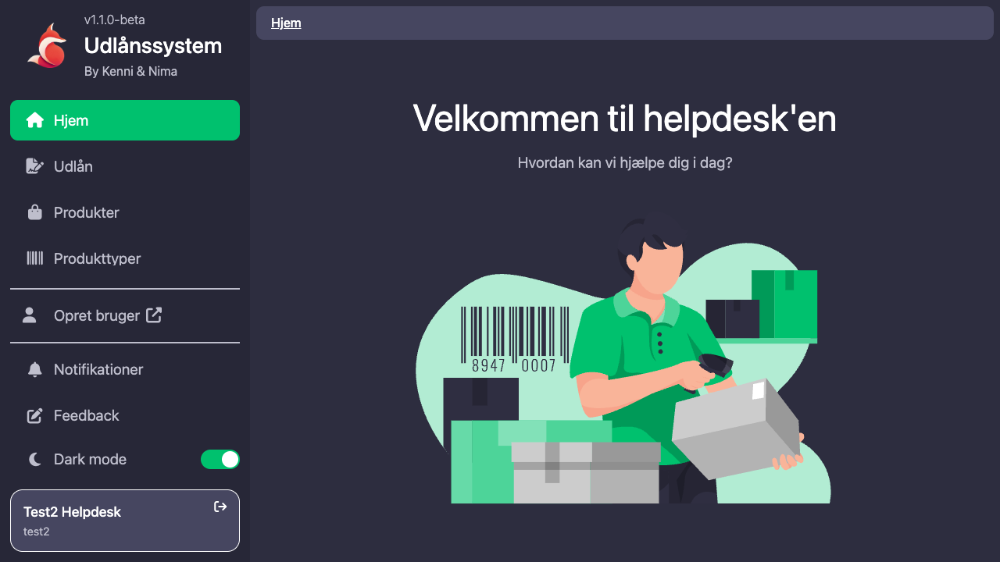

## Tabelvisninger

Mange sider i admin-systemet består af en tabel.

Du kan typisk:

- Klikke på en række for at åbne detaljesiden.
- Søge i en kolonne via feltet `Søg...` under kolonnenavnet.
- Sortere ved at klikke på kolonneoverskriften.
- Bladre mellem sider nederst i tabellen.
- Holde musen nede på en celle for at kopiere værdien til udklipsholderen.

Nogle tabeller har ekstra filtre øverst til højre. På `Udlån` kan du fx slå
`Vis afleverede lån` til. På `Produkter` kan du slå `Vis slettede produkter`
til.

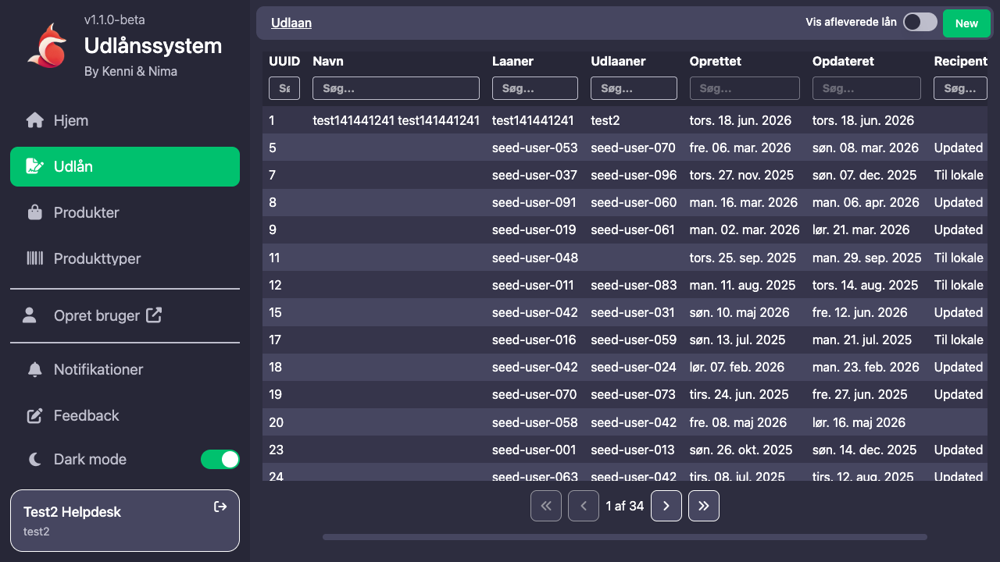

## Opret et nyt lån

Gå til `Udlån` og tryk på `New` øverst til højre.

Oprettelse af lån foregår i fire trin:

1. `Bruger`
2. `Produkter`
3. `Info`
4. `Gennemse`

Grafisk overblik:

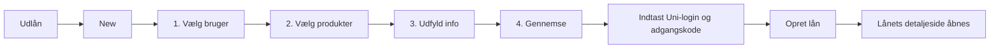

### 1. Vælg bruger

På første trin vises en brugerliste.

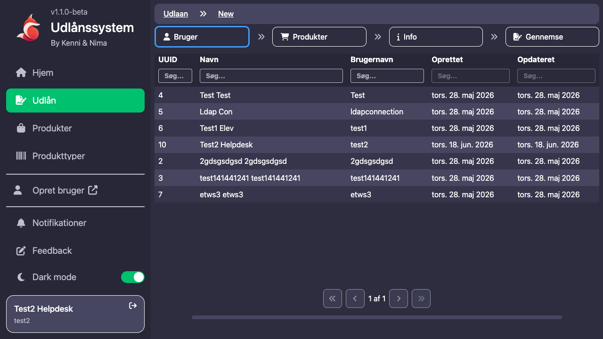

1. Søg eventuelt efter brugeren i tabellen.
2. Klik på den bruger, der skal låne produkterne.
3. Systemet går videre til næste trin.

### 2. Vælg produkter

På produkttrinnet vises tilgængelige produkter til venstre og valgte produkter
til højre.

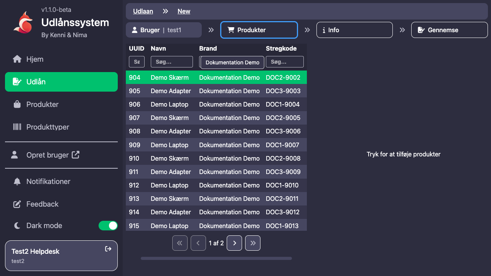

Du kan:

- Klikke på et produkt i venstre tabel for at tilføje det til lånet.
- Klikke på et produkt i højre tabel for at fjerne det igen.
- Scanne en stregkode for hurtigt at tilføje et produkt.

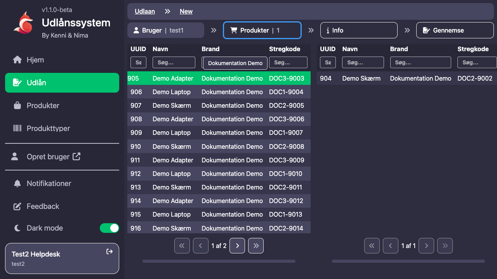

Hvis produktet allerede er valgt eller lånt ud, viser systemet en besked.

### 3. Udfyld låneinfo

På `Info` vælger du de praktiske oplysninger om lånet.

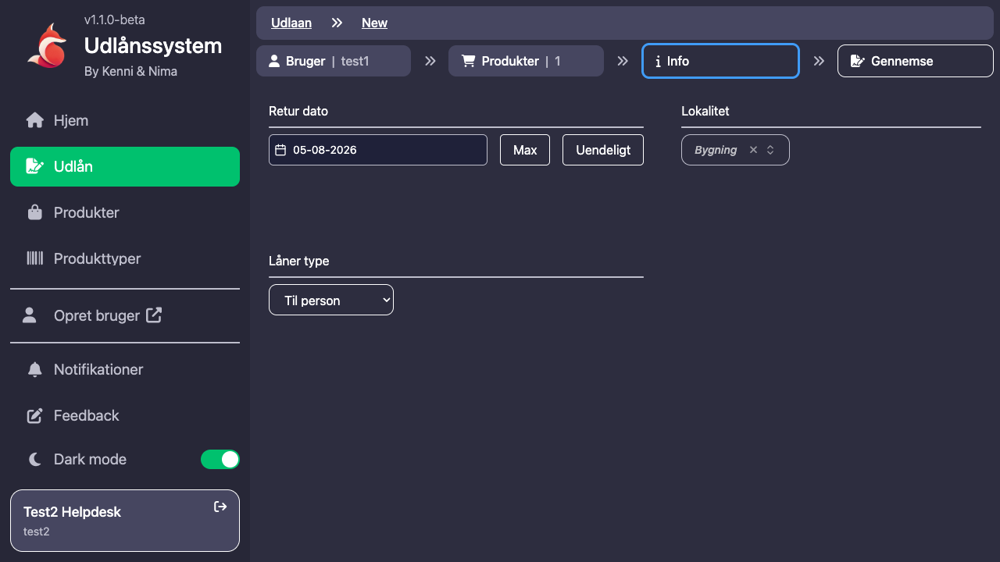

Du kan vælge:

- `Retur dato`: Den dato produktet forventes returneret.
- `Max`: Sætter retur dato til længst mulige periode.
- `Uendeligt`: Bruges hvis der ikke skal sættes en retur dato.
- `Låner type`: Fx `Til person` eller `Til lokale`.
- `Lokalitet`: Vælg bygning og derefter zone, hvis relevant.

Hvis lånet indeholder laptops, kan der også vises ekstra felter for taske og
lås.

### 4. Gennemse og opret

På sidste trin kan du gennemse:

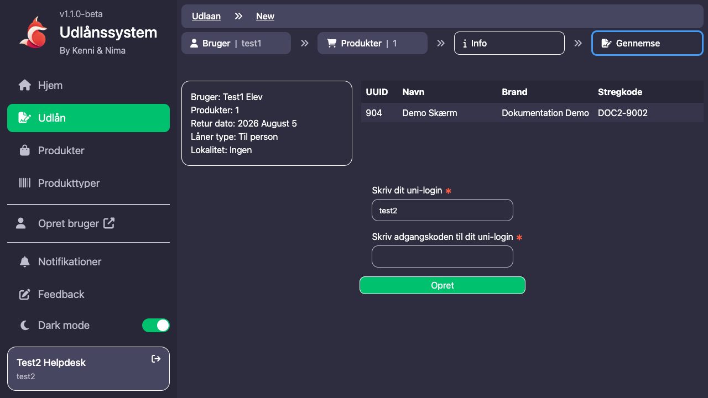

- Brugeren.
- Antal produkter.
- Retur dato.
- Låner type.
- Lokalitet.
- Listen over valgte produkter.

For at oprette lånet skal helpdesk-medarbejderen bekræfte med eget Uni-login og
adgangskode.

1. Tjek at oplysningerne er korrekte.
2. Indtast dit Uni-login.
3. Indtast din adgangskode.
4. Tryk på `Opret`.

Når lånet er oprettet, åbnes lånets detaljeside.

## Se og håndter et lån

Gå til `Udlån` og klik på et lån i tabellen.

På lånets detaljeside kan du typisk:

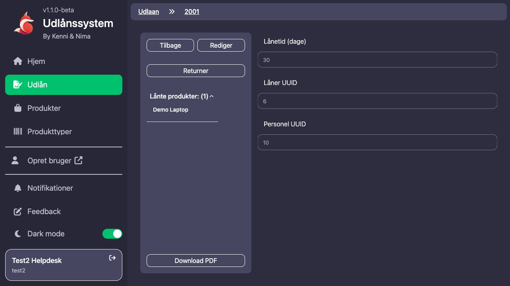

- Se lånets oplysninger.
- Se hvilke produkter der er på lånet.
- Trykke `Returner` for at returnere produkter.
- Trykke `Download PDF` for at hente lånekontrakten.
- Trykke `Rediger`, hvis oplysningerne skal ændres.
- Trykke `Tilbage` for at gå tilbage til listen.

Hvis lånet allerede er returneret, vises det som returneret med datoer.

## Returner produkter

Du kan starte returnering fra et lån ved at trykke `Returner`.

Grafisk overblik:

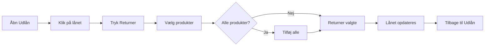

Returneringssiden viser:

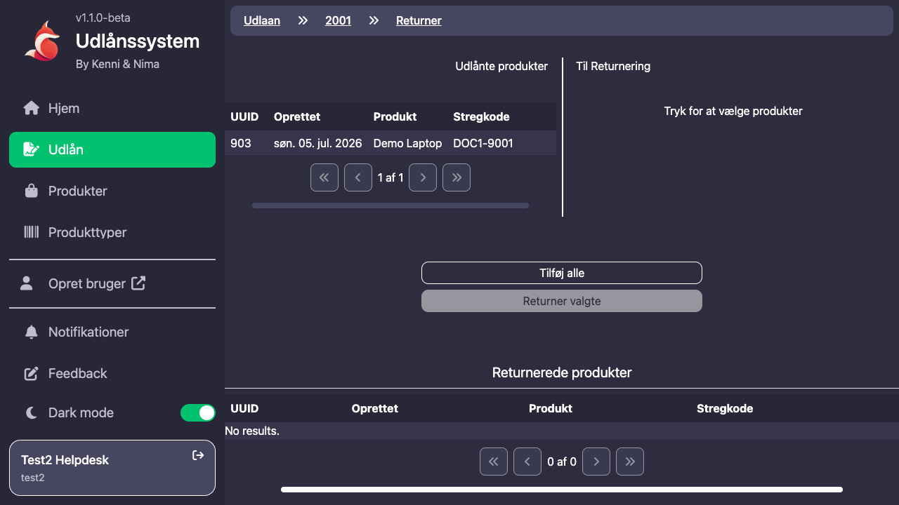

- Produkter der stadig er lånt ud.
- Produkter du har valgt til returnering.
- Produkter der allerede er returneret.

Sådan returnerer du:

1. Klik på et produkt i venstre side for at vælge det til returnering.
2. Klik på et valgt produkt igen, hvis det skal fjernes fra returneringen.
3. Brug eventuelt `Tilføj alle`, hvis alle resterende produkter skal returneres.
4. Tryk `Returner valgte`.

Du kan også scanne stregkoder på returneringssiden. Hvis produktet hører til
lånet, bliver det valgt til returnering.

Når alle produkter på et lån er returneret, bliver selve lånet markeret som
returneret.

## Produkter

Menupunktet `Produkter` viser de fysiske produkter/items i systemet.

Her kan du:

- Se produktnavn, stregkode, status, kommentar og datoer.
- Søge og filtrere i tabellen.
- Åbne et produkt ved at klikke på rækken.
- Slå `Vis slettede produkter` til for at se produkter med andre statusser end
  tilgængelig/lånt ud.

På et produkts detaljeside kan du:

- Se og redigere produkttype, status, stregkode og kommentar.
- Se lånehistorik.
- Gå til aktivt lån, hvis produktet er lånt ud.
- Oprette et nyt lån med produktet, hvis det ikke er lånt ud.
- Kopiere produktet via `Kopier produkt`.

Brug `Rediger` for at ændre felter og `Gem` for at gemme ændringer.

## Produkttyper

Menupunktet `Produkttyper` bruges til at administrere typer/modeller af
produkter.

En produkttype kan fx have:

- Navn.
- Brand.
- Kategori.
- Stregkode prefix.

På en produkttype kan du også trykke `Tilføj nyt produkt ud fra produkttype`.
Her vælger du et antal, og systemet opretter fysiske produkter/items ud fra den
valgte produkttype.

Kort sagt:

- `Produkttyper` er skabelonen/modellen.
- `Produkter` er de konkrete fysiske ting, der kan lånes ud.

## Brugere

Menupunktet `Brugere` viser brugere i systemet.

Du kan:

- Søge efter brugere.
- Klikke på en bruger for at se detaljer.

Der er ikke en `New`-knap på brugersiden i admin-systemet. Nye brugere oprettes
via `Opret bruger` i menuen eller via signup-flowet.

## Stamdata i Mere-menuen

Under `Mere` finder du flere administrationssider:

| Side | Bruges til |
| --- | --- |
| `Kategorier` | Produktkategorier. |
| `Brands` | Produktbrands. |
| `Produkt Statusser` | Statusser for produkter. |
| `Bygninger` | Bygninger/lokationer. |
| `Zoner` | Zoner i bygninger. |
| `Dashboard` | Kommende funktion. |

De fleste stamdatasider fungerer ens:

1. Åbn siden fra menuen.
2. Brug tabellen til at finde eksisterende data.
3. Klik på en række for at redigere.
4. Tryk `New` for at oprette en ny række.
5. Brug `Rediger`, `Gem`, `Annuller`, `Tilbage` og eventuelt `Slet`.

Hvis `Slet` er slået fra, skyldes det typisk, at rækken stadig bruges andre
steder i systemet.

## Redigering og oprettelse

På detaljesider bruges de samme grundknapper mange steder:

| Knap | Betydning |
| --- | --- |
| `Tilbage` | Gå tilbage til forrige side. |
| `Rediger` | Lås felterne op, så de kan ændres. |
| `Gem` | Gem ændringer. |
| `Annuller` | Fortryd ændringer og gå ud af redigering. |
| `Slet` | Slet rækken, hvis det er tilladt. |
| `Opret` | Opret ny række eller handling. |

Ved sletning kan systemet bede dig bekræfte handlingen.

## Feedback

Hvis du vil sende feedback om systemet:

1. Gå til `Feedback`.
2. Skriv en titel.
3. Skriv din besked.
4. Tryk `Indsend`.

Brug feedback til fejl, forslag eller ting der er svære at forstå i hverdagen.

## Gode arbejdsvaner

- Søg i tabellerne i stedet for at scrolle, når du leder efter en bestemt bruger
  eller et bestemt produkt.
- Tjek altid bruger og produktliste på `Gennemse`, før du opretter et lån.
- Brug stregkodescanner ved udlån og returnering, når det er muligt.
- Returner kun de produkter, du faktisk har modtaget.
- Brug status og kommentar på produkter til at gøre det tydeligt, hvis noget er
  defekt, væk eller kræver opmærksomhed.
- Log ud, når du er færdig på en delt computer.

## Når noget ikke virker

Prøv først dette:

- Genindlæs siden.
- Tjek at du stadig er logget ind.
- Tjek om du har de nødvendige rettigheder.
- Prøv at søge efter varen eller brugeren i stedet for at scrolle.
- Ved stregkodeproblemer: tjek at scanneren faktisk skriver den rigtige kode.

Hvis problemet fortsætter, send feedback eller kontakt en systemansvarlig med:

- Hvad du prøvede at gøre.
- Hvilken side du var på.
- Hvilken fejlbesked du så.
- Hvilken bruger, vare eller stregkode problemet handlede om.
